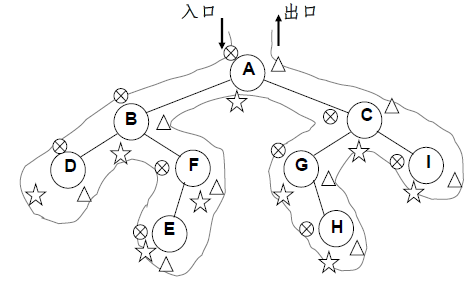
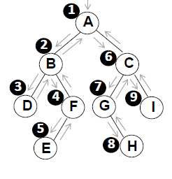
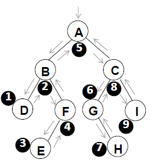
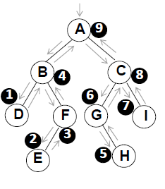
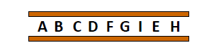
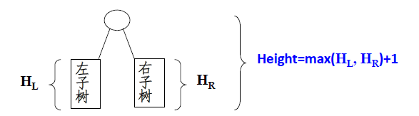
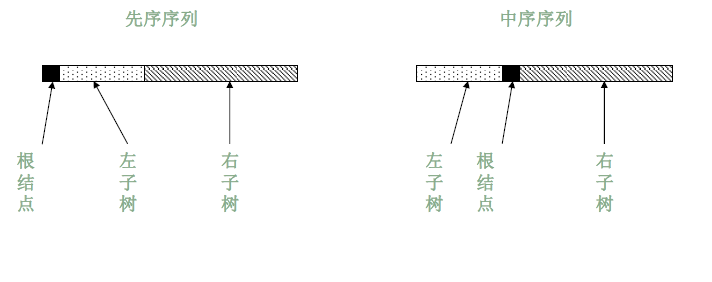

---
layout:	post
title:	"3.3二叉树遍历"
data:	2018-11-15 14:00:00
categories: LearnDataStructure
tags:	二叉树 BinaryTree
author: lydia Lee
mathjax: true
---

* content
{:toc}

本文主要记录在MOOC上学习到的二叉树遍历相关主题


[TOC]
#### **3.3.1遍历方式**
先序遍历、中序遍历、后序遍历、层次遍历

- **先序遍历**
访问跟结点、先序遍历其左子树、先序遍历其右子树
- **中序遍历**
中序遍历其左子树、访问根节点、中序遍历右子树
- **后序遍历**
后序遍历左子树、后序遍历右子树、访问根结点
- **层次遍历**

**先序、中序和后序遍历过程：**遍历过程中经过的结点的路线一样，只是访问各结点的时机不一样
从入口到出口的曲线上用圆圈叉号、星号和三角三种符号分别标记出了先序、中序和后序访问各结点的时刻

#### **3.3.2 实现方式**
递归实现、非递归实现

##### **1)树的构造**
**数据**
```cpp
//data.txt
9
A 1 2
B 3 4
C 5 6
D - -
F 7 -
G - 8
I - -
E - -
H - -
```

**树的存储结构结构**
```cpp
typedef struct BiNode
{
    char data;
    BiNode *lChild=NULL;
    BiNode *rChild=NULL;
} BiNode,*BiTree;
```

**构建树**
```cpp
BiTree createTree(string filename)
{
    std::ifstream fin;
    fin.open(filename.c_str());
    int nodesize;
    fin>>nodesize;
    BiTree nodelist=new BiNode[nodesize];
    for(int i=0;i<nodesize;i++)
    {
        char data, lc,rc;
        fin>>data>>lc>>rc;

        nodelist[i].data=data;
        if(lc!='-')
        {
            nodelist[i].lChild=nodelist+(lc-'0');//指向数组相应的位置
        }
        else
        {
            nodelist[i].lChild=NULL;
        }
        if(rc!='-')
        {
            nodelist[i].rChild=nodelist+(rc-'0');
        }
        else
        {
            nodelist[i].rChild=NULL;
        }

    }
    fin.close();

    return nodelist;
}
```
##### **2)前序遍历**
**结果：**
```cpp
Preoreder traversal:
A B D F E C G H I
```

**递归实现**
```cpp
//递归前序遍历
void RecursionPreOrderTraversal(BiTree bitree)
{
    if(bitree)
    {
        std::cout<<bitree->data<<" ";
        RecursionPreOrderTraversal(bitree->lChild);
        RecursionPreOrderTraversal(bitree->rChild);
    }
}
```
**非递归实现**
主要思路：使用堆栈。堆栈的作用是保存父节点，遍历完左子树后，弹出栈顶并遍历其右子树
- 遇到一个结点，就把它压栈并访问它，并去遍历它的左子树；
- 当左子树遍历结束后，从栈顶弹出这个结点；
- 然后按其右指针再去中序遍历该结点的右子树。

```cpp
//非递归前序遍历
void NonRecursionPreOrderTraversal(BiTree bitree)
{
    std::stack<BiNode*> mystack;
    BiNode* BN=bitree;//用于遍历的指针
    while(BN||!mystack.empty())
    {
        while(BN)
        {
            mystack.push(BN);
            std::cout<<BN->data<<" ";
            BN=BN->lChild;
        }
        BN=mystack.top();
        mystack.pop();
        BN=BN->rChild;
    }
}
```
##### **3)中序遍历**
中序遍历和前序遍历，不管是递归还是非递归，都只有一句代码的位置的区别

**结果**
```cpp
Inorder traversal:
D B E F A G H C I
```

**递归实现**
```cpp
//递归中序遍历
void RecursionPreOrderTraversal(BiTree bitree)
{
    if(bitree)
    {
        RecursionPreOrderTraversal(bitree->lChild);
		std::cout<<bitree->data<<" ";
        RecursionPreOrderTraversal(bitree->rChild);
    }
}
```
**非递归实现**
```cpp
//非递归中序遍历
void NonRecursionInOrderTraversal(BiTree bitree)
{
    BiNode* BN=bitree;
    std::stack<BiNode *> mystack;
    while(BN||!mystack.empty())
    {
        while(BN)
        {
            mystack.push(BN);
            BN=BN->lChild;
        }
        BN=mystack.top();
        mystack.pop();
        std::cout<<BN->data<<" ";
        BN=BN->rChild;
    }
}
```
##### **4)后序遍历**
**结果：**
```cpp
Postorder traversal:
D E F B H G I C A
```
**递归实现**
与前序遍历、后序遍历套路相同

```cpp
//递归后序遍历
void RecursionPostOrderTraversal(BiTree bitree)
{
    if(bitree)
    {
        RecursionPostOrderTraversal(bitree->lChild);
        RecursionPostOrderTraversal(bitree->rChild);
        std::cout<<bitree->data<<" ";
    }
}
```
**非递归实现**
主要思路：

- 采用非递归的根节点->右子树->左子树的方式遍历整个树（参考树的非递归前序遍历）
- 将每次访问到的结点存储在辅助栈resultstack内
- 依次弹出栈内元素（左子树->右子树->根节点）

```cpp
//非递归后序遍历
void NonRecursionPostOrderTraversal(BiTree bitree)
{
    BiNode* BN=bitree;
    std::stack<BiNode*> mystack;
    std::stack<BiNode *> resultstack;

    //效仿非递归的前序遍历，访问所有元素
    while(BN||!mystack.empty())
    {
        while(BN)
        {
            mystack.push(BN);//第一次访问该元素时，存储进resultstack
            resultstack.push(BN);
            BN=BN->rChild;
        }

        BN=mystack.top();
        mystack.pop();
        BN=BN->lChild;
    }

    //依次出栈resultstack中的元素
    while(!resultstack.empty())
    {
        std::cout<<resultstack.top()->data<<" ";
        resultstack.pop();
    }
}
```

##### **5)层次遍历**
- 需要一个存储结构保存暂时不访问的结点
- 存储结构：堆栈、队列

**主要思路：**
队列实现：遍历从根结点开始，首先将根结点入队，然后开始执行循环：结点出队、访问该结点、其左右儿子入队
**结果:**
```cpp
Level Order Traversal:
A B C D F G I E H
```

```cpp
//层次遍历
void LevelOrderTraversal(BiTree bitree)
{
    std::queue<BiNode *> myqueue;
    BiNode * BN=bitree;

    if(BN)
    {
        myqueue.push(BN);

        while(!myqueue.empty())
        {
            BN=myqueue.front();
            std::cout<<BN->data<<" ";
            myqueue.pop();
            if(BN->lChild)
            {
                myqueue.push(BN->lChild);
            }
            if(BN->rChild)
            {
                myqueue.push(BN->rChild);
            }
        }
    }
}
```
##### **6)测试程序**
```cpp
int main()
{
    BiTree binary_tree=createTree("data.txt");

    std::cout<<"Preoreder traversal:\n";
    NonRecursionPreOrderTraversal(binary_tree);

    std::cout<<"\nInorder traversal:\n";
    NonRecursionInOrderTraversal(binary_tree);

    std::cout<<"\nPostorder traversal:\n";
    NonRecursionPostOrderTraversal(binary_tree);

    std::cout<<"\nLevel Order Traversal:\n";
    LevelOrderTraversal(binary_tree);

    std::cout<<"\nPrint Leaves:\n";
    PreOrderPrintLeaves(binary_tree);

    std::cout<<"\nGet Height:\n";
    int height=PostOrderGetHeight(binary_tree);
    std::cout<<height;
    
    return 0;
}
```
#### **3.3.3 例子**
##### **1) 输出二叉树叶子结点**
在二叉树的遍历算法中增加检测结点的“左右子树是否都为空”。
```cpp
//输出二叉树的叶子结点
void PreOrderPrintLeaves(BiTree bitree)
{
    if(bitree)
    {
        if(!bitree->lChild&&!bitree->rChild)
        {
            std::cout<<bitree->data<<" ";
        }

        PreOrderPrintLeaves(bitree->lChild);
        PreOrderPrintLeaves(bitree->rChild);
    }
}
```

##### **2)输出二叉树深度**


```cpp
//得到树的深度
int PostOrderGetHeight(BiTree bitree)
{
    if(bitree)
    {
        int lHeight,rHeight,maxHeight;
        lHeight=PostOrderGetHeight(bitree->lChild);
        rHeight=PostOrderGetHeight(bitree->rChild);

        maxHeight=lHeight>=rHeight?lHeight+1:rHeight+1;
        return maxHeight;
    }
    else
    {
        return 0;
    }
}
```

##### **3)二叉树恢复**
前序中序或中序后序


